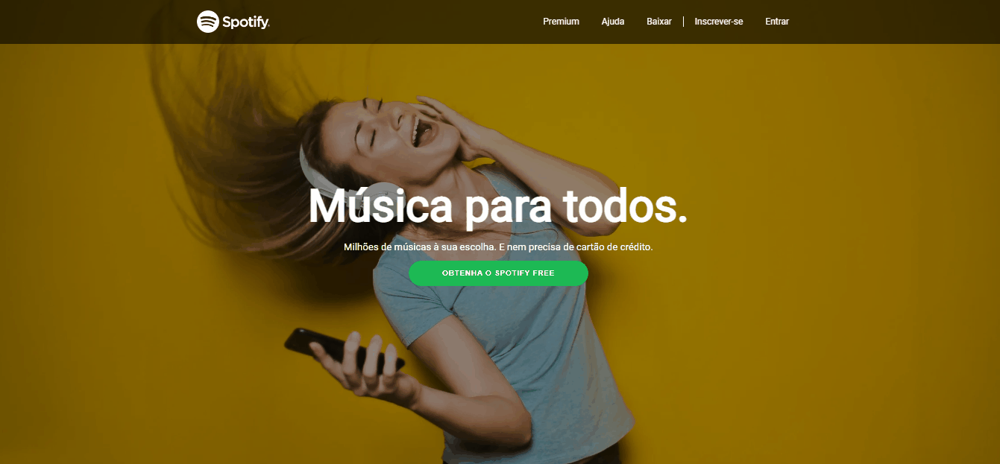

  

O projeto tem como proposta replicar a landing page da página inicial do site de streaming de música Spotify.  

#### Não funcional apenas demonstrativo!

 

---

### Tecnologias utilizadas:

- HTML5
- CSS3

---

### Acesse a página <a href="https://johnatanbarbosa.github.io/Clone_Spotify.github.io/">aqui</a>

 

### Autor:

 
<b>Johnatan Barbosa🚀</b>

Espero que goste, entre em contato!

